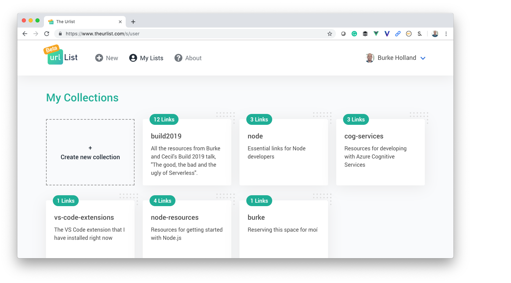

# The Urlist - An Azure Serverless Application Study

## What Is This?

The Urlist is a production application that tests and proves application implementation scenarios for serverless applications running on Microsoft Azure. Read more about the project in the [announcement blog post](https://hackernoon.com/the-urlist-an-application-study-in-serverless-and-azure-13c2e3b07dd2).

This organization serves as the home for different implementations of the various pieces of the project.

The Urlist has two distinct parts - the frontend (a single-page-application) and the backend (an API).

## Current frontend implementations

[Vue / TypeScript](https://github.com/the-urlist/frontend-vue-typescript)

## Current backend implementations

[C#](https://github.com/the-urlist/backend-csharp)
